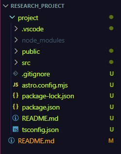
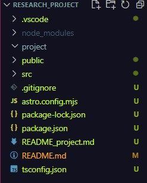

# Research project
Hoe maak je een interactieve boekenwebshop met Astro en de View Transition API?

# Installatie
```
npm create astro@latest
```

En typ y om de installatie te laten starten. Dan komen er een aantal vragen die je moet beantwoorden. Hier heb ik even de antwoorden opgesomd die ik heb gegeven.

"Where should we create your new project?" Omdat Astro alleen in een lege mag een project kan maken, moet je een nieuwe map aanmaken of een bestaande lege ingeven. In mijn geval heb ik een nieuwe map aangemaakt met de naam `./project` omdat ik al een README.md file had.

"How would you like to start your project?" Hier kies je voor `Empty`.

"Install dependencies? (recommended)" Hier kies je voor `Yes`.

"Do you plan to write TypeScript?" Hier kies je voor `Yes`.

"How strict should TypeScript be?" Hier kies je voor `Strict (recommended)`.

"Initialize a new git repository? (optional)" Hier kies je voor `No` als je geen git repository hebt aangemaakt. In mijn geval had ik dat wel al gedaan.

Nadat de installatie gedaan is, zou je dit moeten zien: </br>


Voordat ik alles verzet naar de root folder `Research_project`, hernoem ik de README.md naar `README_project.md` om confilcten te voorkomen. De `README_project.me` hou ik nog even bij om belangrijke zaken niet te missen.

Pas dan verzet ik alles naar de root folder `Research_project` en ziet de folder er zo uit: </br>
